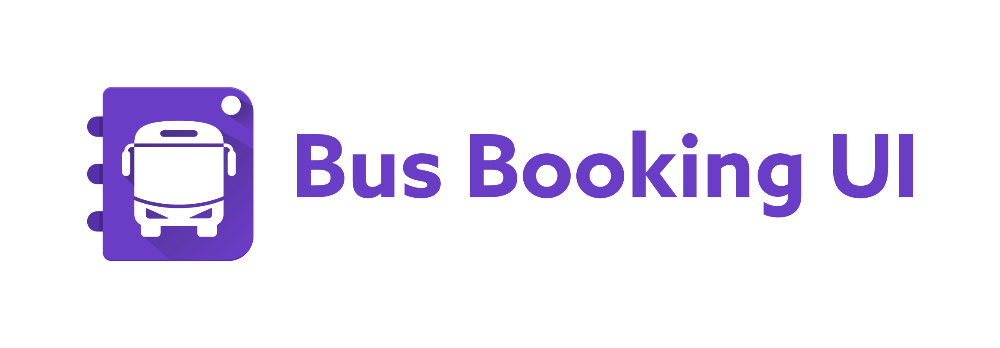

<h1 align=center>

</h1>

# BusBookingUI-Android
Check out the new style for App Design aims for Bus Booking Service...😉😀😁😎

## Screenshots

**Please click the image below to enlarge.**

## Contributing

Please fork this repository and contribute back using
[pull requests](https://github.com/Shashank02051997/BusBookingUI-Android/pulls).

Any contributions, large or small, major features, bug fixes, are welcomed and appreciated
but will be thoroughly reviewed .

### Contact - Let's become friend
- [Twitter](https://twitter.com/shashank020597)
- [Github](https://github.com/Shashank02051997)
- [Linkedin](https://www.linkedin.com/in/shashank-singhal-a87729b5/)
- [Facebook](https://www.facebook.com/shashanksinghal02)

### Like our facebook page
- [Android UI's Bucket](https://www.facebook.com/androiduisbucket)

## Donation
If this project help you reduce time to develop, you can give me a cup of coffee :) 

